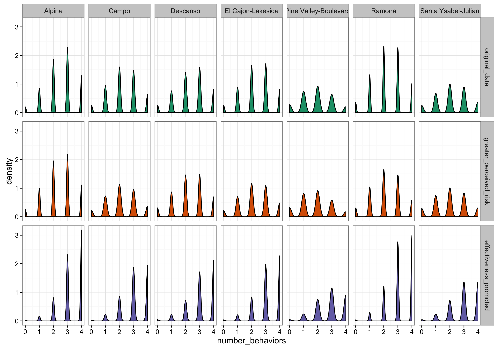

```{r setup, include = FALSE}
library(rethinking)
library(dplyr)
library(tidyr)
library(ggplot2)
theme_set(new = theme_bw())
d = readRDS('../data/derived/dataVImodel.RDS') %>% as.data.frame()
```


## Methods

To empirically parameterize homeowner-agent behavior, we conditioned a multi-level Bayesian statistical model on data from 637 homeowner survey respondents. We then use the model to generate new households drawn from the distribution implied by the model. The outcome variable of the model is the number of defensible space practices adopted by each homeowner, which we instantiate as a binomially distributed process. The model contains varying intercepts at the level of town ($\alpha_{town}$), which allows the model to pool information across towns in determining the base adoption rate and models the effect of social forces on homeowner behavior. Experience with fire is included as a predictor as the natural logarithm of the distance of the home from recent fires ($D$). Three additional predictors were constructed from survey responses to charactarize the psychological makeup of homeowners: policy beliefs ($P$), beliefs about the effectiveness of defensible space practices ($E$), and beliefs about risk associated with wildfire ($R$). We employed weakly regularizing priors ($\mathcal{N}(0, 1)$) for all four continuous predictors to reign-in overfitting. The model takes the form:

$$
\begin{aligned}
N_i &\sim binomial(4, p_i) \\
logit(p_i) &= \alpha_{town[i]} + \beta_{P} P + \beta_{E} E + \beta_{R} R + \beta_{D} ln(D) \\
\alpha_{town} &\sim Normal(\alpha, \sigma_{town}) \\
\alpha &\sim Normal(0,5, 1) \\
\beta_{P} &\sim Normal(0, 1) \\
\beta_{E} &\sim Normal(0, 1) \\
\beta_{R} &\sim Normal(0, 1) \\
\beta_{D} &\sim Normal(0, 1) \\
\sigma_{town} &\sim HalfCauchy(0, 2).
\end{aligned}
$$

All analyses were performed in R version 3.3.1 [@r_core_team_r:_2016]. For statistical modeling, we used the rethinking package [@mcelreath_rethinking:_2015] which samples posterior distributions using Hamiltonian Monte Carlo via Stan [@stan_development_team_stan:_2015]. The full reproducability suite of data and code are available in a repository at XXX (xxx.com). 

To generate new households, ... We simulate each households' number of behaviors for 1,000 sets of parameter values drawn from the joint posterior.... 

## Results

### Summary Statistics

Figure 1 shows the distribution of number of defensible space behaviors, out of four possible, adopted per household by town. The modal number of behaviors adopted is four, but the median is two and the mean is `r round(mean(d$numBehaviors), 2)`. Figure 1 also shows the number of survey responses in our dataset from each town, which are roughly proportional to the number of homes in the WUI in each town.

### Model Coefficients

Table 1 presents parameter values and 95% credibility intervals for each of the predictors in the model. Belief in the effectiveness of defensible space behaviors is a strong positive predictor of implementation of defensible space behavior. Policy beliefs, which is an aggregate measure capturing [**FILL THIS IN**], and perceived risk associated with wildfire are both negatively associated with defensible space adoption, but there is ambiguity around those relationships. Individuals who are closer to recent fires tend to have adopted more defensible space behavior, but this relationship also has significant uncertainty. There is substantial town-to-town variability in the base-rate of adoption: The distribution of town-level intercepts has its mean at 0.32 and a standard deviation of 0.23. 

```{r, fig.height = 3, echo = FALSE, fig.cap = "Number of defensible space behaviors adopted per household by town."}
ggplot(d, aes(numBehaviors, fill = reorder(city, city, function(x) length(x)))) + 
  geom_bar() + 
  scale_fill_discrete(guide = guide_legend(title = "Town", reverse = TRUE)) +
  xlab("Number of adopted defensible space behaviors") +
  ylab("Number of households")
```

Table: Marginal parameter 95% credibility intervals for varying intercepts model of number of defensible space behaviors adopted by a household. $\alpha$ represents the (town-level) mean intercept (of $logit(p)$) and $\sigma_{town}$ the standard deviation of the distribution of town-level $\alpha$'s.

|                                 | Mean  |  SD  | Lower 95% CI | Upper 95% CI |
|:--------------------------------|:-----:|:----:|:------------:|:------------:|
|$\beta_{P}$                      | -0.06 | 0.04 |    -0.14     |     0.03     |
|$\beta_{E}$                      | 0.52  | 0.05 |     0.43     |     0.61     |
|$\beta_{R}$                      | -0.06 | 0.04 |    -0.15     |     0.02     |
|$\beta_{D}$                      | -0.05 | 0.05 |    -0.15     |     0.04     |
|$\alpha$                         | 0.32  | 0.12 |     0.07     |     0.55     |
|$\sigma_{town}$                  | 0.23  | 0.14 |     0.03     |     0.50     |
|$\alpha_{Alpine}$                | 0.55  | 0.09 |     0.38     |     0.72     |
|$\alpha_{Campo}$                 | 0.22  | 0.15 |    -0.10     |     0.50     |
|$\alpha_{Descanso}$              | 0.40  | 0.14 |     0.12     |     0.67     |
|$\alpha_{El Cajon-Lakeside}$     | 0.35  | 0.12 |     0.12     |     0.58     |
|$\alpha_{Pine Valley-Boulevard}$ | 0.11  | 0.23 |    -0.36     |     0.50     |
|$\alpha_{Ramona}$                | 0.37  | 0.06 |     0.25     |     0.49     |
|$\alpha_{Santa Ysabel-Julian}$   | 0.26  | 0.14 |    -0.03     |     0.53     |


### Generating Agents

We can then use the model to generate agent-households with defensible space behaviors arising naturally from any set of attributes. There are two levels of stochasticity in this process: parameters drawn from the joint posterior distribution, and simulated binomial outcomes, with $p$ (deterministically) calculated from the model coefficients and predictor values. We demonstrate this by generating new households with the same set of predictor values as the survey respondents. This serves as a model check and demonstrates the process. Figure 2 shows the results of this exercise. Note that the model preserves substantial uncertainty around how many behaviors a household adopts, and that the level of uncertainty depends on the predictor values (for example a house in a town for which less data is available will have greater uncertainty).

```{r, echo = FALSE, results = "hide", fig.cap = "For 25 randomly sampled homes, red diamonds are empirical number of defensible space behaviors, and violin plots reflect the distribution of model-implied behaviors for simulated households with the same set of predictor values."}
m = readRDS("../data/derived/varyInterceptModel.RDS")
set.seed(3957)
sims = sim(m, data = d)
samp = sample(nrow(d), 25)
empDF = data.frame(key = paste0("V", samp), value = d$numBehaviors[samp])
# ord = empDF$key[order(empDF$value)]
simDF = as.data.frame(sims)[, samp] %>%
  gather()

ggplot(empDF, aes(reorder(key, value), value)) +
  geom_point(shape = 18, color = "red", size = 4) +
  geom_violin(data = simDF, alpha = 0) +
  scale_x_discrete(name = "Household", breaks = 0) +
  ylab("Number of defensible space behaviors adopted")

```

We can leverage the varying intercepts structure to generate new individuals from towns that were not observed in our dataset by drawing town-level $\alpha$'s from the model-implied distribution. We can also run scenarios by changing predictor values; for example, we can examine the effects of hypothetical education outreach programs by increasing the values of predictors for effectiveness of defensible space behavior or perceived risk. The outcome of such an exercise is presented in Figure 3.



## References