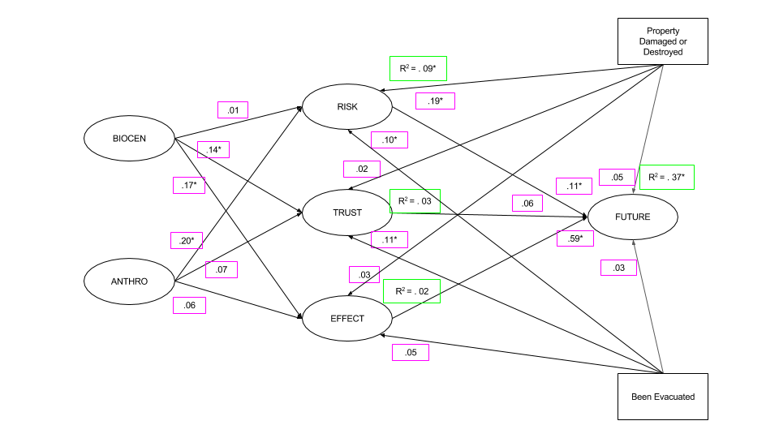

Fire on the fringe: Empirically parameterizing defensible space behavior in an agent based model
========================================================
author: Katie M. Lyon, Michael Levy, Kenny Wallen, Patrick Bitterman, Ellen Esch, Michael Saha, James D. Absher, Gerard Kyle
date: 

Introduction
========================================================
problem statement and/or research objective

Why ABM? (Michael)
========================================================
- Humans are major driver of natural system dynamics, therefore models of natural systems need realistic representation of human behavior
- Traditional economic models impose strong assumptions about rationality and economically optimal behavior
- Evidence those assumptions are wrong and can bias model results
- ABM has advantage of flexible behavior. An agents behavior can be any function of
  - Environmental conditions
  - Social and economic conditions
  - Historical events
- However, that flexibility can be a liability: When behavior rules become even modestly complicated the drivers of system behavior can become elusive.
- Assumptions built into behavior rules
- Parameter space often too large to search completely
- So, need principled way to code behavior.
- Lots of thought on how to do it empirically (Smajgl book)
- Despite that, there is a well-developed, empirically grounded methodology for estimating behavior as a function of the kind of environmental variables that we find in a CHANS/SES model that is used in multiple disciplines: SEM.

Approaches to empirically inform ABMs
========================================================
1. Sample surveys
2. Participant observation
3. Field and laboratory experiments
4. Companion modeling
5. GIS and remotely sensed spatial data

*Robinson et al., 2007*

Approaches to empirically inform ABMs
========================================================
1. **Sample surveys** 
2. Participant observation
3. Field and laboratory experiments
4. Companion modeling
5. GIS and remotely sensed spatial data

*Robinson et al., 2007*

Structural Equation Modeling
========================================================
Why SEM
Examples of application to ABM
- Diffusion of Innovation (e.g, Lorscheid et al., 2014; Schwarz & Ernst, 2009)
- Theory of Planned Behavior (e.g., Ceschi et al., 2015)

Study Purpose
========================================================
- model household decisions of firewise behavior (i.e., do they create defensible space) in the San Diego WUI
- describe an empirical parameterization of agent behavior for a coupled model based on survey data of residents

Structural equation modeling (SEM)
========================================================
- standard statistical method in the social sciences

- Measurement model
  + relationships between latent variables and their observed indicators

- Structural model
  + relationships between the latent variables

Structural equation modeling (SEM)
========================================================
SEM provides a modeling anchor for:  
1. set of decision criteria that play a role in the given decision process  
2. existing relationships between the criteria  
3. relative relevance of criteria

*Lorsheid et al., 2014*

Methods
========================================================
- Empirical survey

San Diego WUI
========================================================
- San Diego County
  + 3.1 million residents (5th largest in US)
- San Diego (metropolitan area)
  + 1.4 million residents (8th largest in US)
  + Projected 40% population growth / 88% increase in residential acreage by 2050
- Mild Mediterranean-Semiarid climate

Measurement and analysis
========================================================
Structural equation modeling

Structural equation model
========================================================

Agent typology?
========================================================
Cluster analysis
Groups analysis

Agents
========================================================
- Each agent gets a set of coefficient values from joint distribution 
- Decision process model for agent
- For each agent typology?
- State variables change as a function of local environmental and social conditions in the model
- At each time step, agents update their likelihood of implementing DS behavior (implementation stochastic or deterministic?)

Decision process (Michael, Katie, Patrick)
========================================================
- Decision criteria

Calibration
========================================================
- calibrate with survey data?

Results
========================================================
- Validation
- Scenarios

Agent-based model?
========================================================
- Each household will make a decision about whether to implement (will assume that a change in behavior to firewise is permanent?)
- Will we assume a static population (i.e., without migration)?
- Fire season will occur at an annual timestep. 

Discussion
========================================================
- What our model did (i.e., tell them what we told them we would do)
- What it did well? not well?
- Usefulness? Practicality?

Future Research
========================================================
Coupled model
- Figure of our conceptual model?

